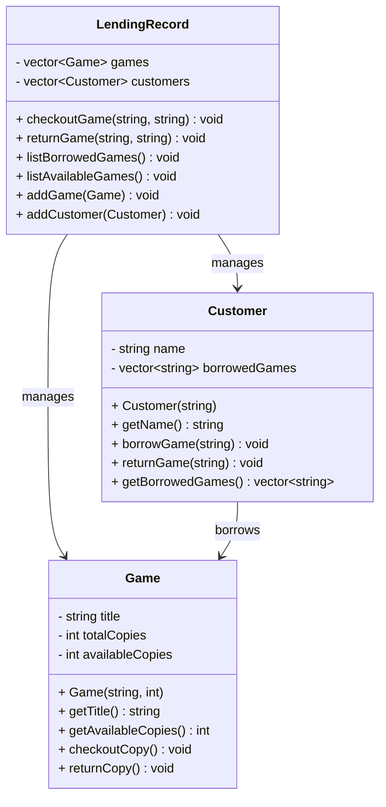

#  Program Specification

The **Board Game Lending Tracker** is a lightweight inventory and checkout system designed for a local board game café. It enables the café owner to:

- View a list of all board games, including the number of available copies.
- Check out games to customers and track who has borrowed which game.
- Record when games are returned.

The system manages three primary entities: **Game**, **Customer**, and **LendingRecord**. It operates locally, providing an efficient and user-friendly interface for managing game lending activities.

---

##  Nouns (Entities / Attributes)

- Game
- Customer
- Lending Record
- Title
- Copies
- Due Date
- Borrowed Games

---

##  Verbs (Behaviors / Methods)

- Add Game
- List Games
- Check Out Game
- Return Game
- View Borrowed Games

---

##  Class Design

### `Game`

```cpp
class Game {
public:
    Game(const std::string& title, int totalCopies);

    std::string getTitle() const;
    int getAvailableCopies() const;
    void checkoutCopy();
    void returnCopy();

private:
    std::string title;
    int totalCopies;
    int availableCopies;
};

class Customer {
public:
    Customer(const std::string& name);

    std::string getName() const;
    void borrowGame(const std::string& gameTitle);
    void returnGame(const std::string& gameTitle);
    std::vector<std::string> getBorrowedGames() const;

private:
    std::string name;
    std::vector<std::string> borrowedGames;
};

class LendingRecord {
public:
    void checkoutGame(const std::string& customerName, const std::string& gameTitle);
    void returnGame(const std::string& customerName, const std::string& gameTitle);
    void listBorrowedGames() const;
    void listAvailableGames() const;
    void addGame(const Game& game);
    void addCustomer(const Customer& customer);

private:
    std::vector<Game> games;
    std::vector<Customer> customers;
};

